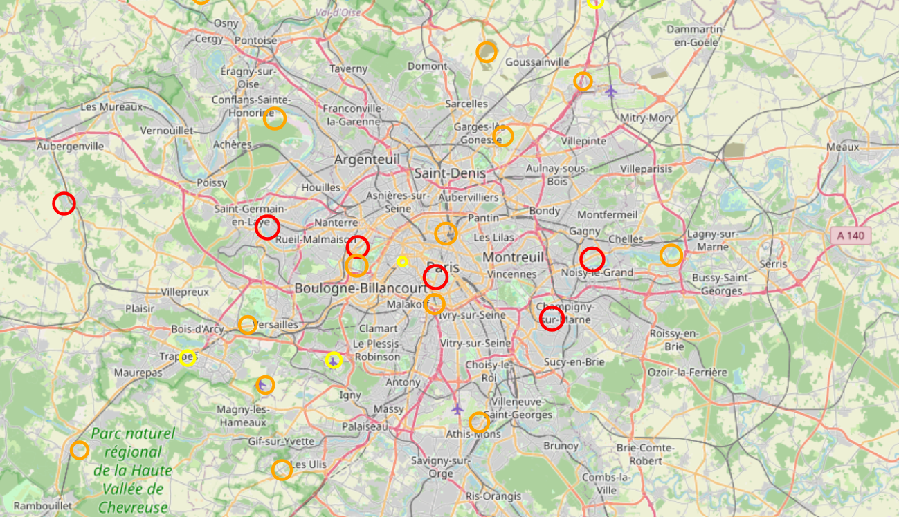
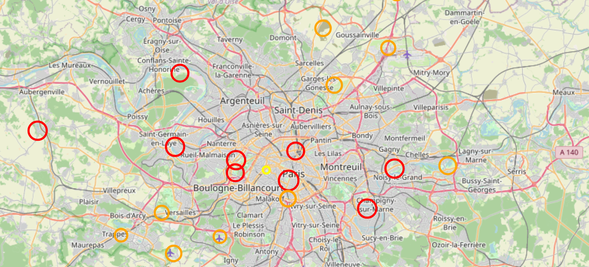

# Analyse spatiale des températures maximales en Île-de-France

## Contexte

Les villes sont souvent confrontées à des phénomènes de concentration de chaleur, se traduisant par des températures plus élevées dans certains secteurs que dans d'autres.

Ces variations peuvent avoir des impacts importants, notamment sur la santé et la qualité de vie.

## Objectifs

L'objectif de ce projet est d'identifier les secteurs les plus chauds en Île-de-France à partir de données de température, puis d'explorer certains facteurs susceptibles d'expliquer ces différences.

## Données

Les données utilisées proviennent du jeu de données « [Données climatologiques de base quotidiennes](https://www.data.gouv.fr/datasets/donnees-climatologiques-de-base-quotidiennes) » disponible sur data.gouv.fr.

Elles couvrent plusieurs stations météorologiques situées en Île-de-France et sont réparties en plusieurs fichiers correspondant aux différents départements de la région.

Les données s'étendent de janvier 2025 à avril 2026, avec une fréquence quotidienne.

Elles contiennent notamment des informations de température utilisées pour l'analyse exploratoire et statistique.

## Méthode

L'analyse repose sur les étapes suivantes :

* regroupement des différents fichiers en un seul jeu de données  
* nettoyage et préparation des données  
* analyse exploratoire des températures  
* identification des secteurs les plus chauds  
* visualisation des résultats (cartes et graphiques)

## Principaux résultats

Les analyses ont été réalisées à partir des données complètes, puis restreintes à la période estivale (mai à septembre) pour certaines visualisations afin d'isoler les périodes de chaleur.

L'analyse temporelle montre une évolution saisonnière classique des températures, sans apport explicatif supplémentaire.

L'analyse spatiale globale ne met pas en évidence de différence marquée entre Paris et sa proche couronne en termes de températures moyennes.

L'analyse locale permet toutefois d'identifier certaines stations présentant des températures plus élevées, visibles sur les cartes produites.

Cependant, les analyses statistiques (corrélations et régression linéaire) ne montrent pas de relation significative entre la température et les variables étudiées (densité de population et distance au centre de Paris).

Ces résultats suggèrent que les facteurs testés ne suffisent pas à expliquer les variations de température observées.

## Visualisations

Les visualisations permettent d'explorer la répartition spatiale des températures et d'illustrer les principales tendances observées dans les données.

### Carte des températures moyennes (période complète)

La carte suivante présente les températures moyennes observées sur l'ensemble de la période d'étude pour les différentes stations en Île-de-France.

### Carte des températures estivales

Une seconde carte est produite en se concentrant sur la période estivale (mai à septembre), afin de mieux visualiser les zones potentiellement les plus chaudes.

### Remarques générales

Ces visualisations mettent en évidence des variations spatiales locales des températures entre stations. Toutefois, aucune structure spatiale très marquée ne se dégage à l'échelle globale de la région Île-de-France.

## Conclusion

Cette étude a permis d'explorer les variations spatiales des températures en Île-de-France à partir de données de stations météorologiques.

Les analyses montrent une hétérogénéité locale des températures, visible sur les cartes, mais ne mettent pas en évidence de relation linéaire forte avec les variables étudiées (densité de population et distance au centre de Paris).

## Limites et perspectives

Cette analyse présente plusieurs limites :

- le nombre de stations disponibles reste limité
- seules deux variables explicatives ont été étudiées
- un modèle linéaire simple a été utilisé.

Des améliorations possibles incluraient l'intégration de variables environnementales supplémentaires, notamment la végétation et la proximité de l'eau, afin de mieux expliquer les variations locales de température.
